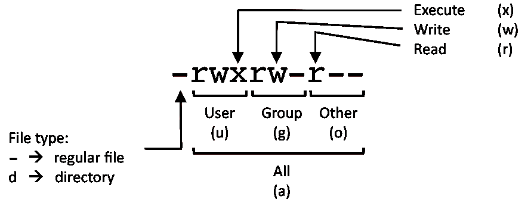

#SYSTEM INFORMATION
- Display Linux system information: 
```shell script
uname -a
```

- Display kernel release information: 
```shell script
uname -r
```

- Show which version of redhat installed: 
```shell script
cat /etc/redhat-release
```

- Show how long the system has been running + load: 
```shell script
uptime
```

- Show system host name: 
```shell script
hostname
```

- Display the IP addresses of the host: 
```shell script
hostname -I
```

- Show system reboot history: 
```shell script
last reboot
```

- Show the current date and time: 
```shell script
date
```

- Show this month's calendar: 
```shell script
cal
```

- Display who is online: 
```shell script
w
```

- Who you are logged in as: 
```shell script
whoami
```
#HARDWARE INFORMATION
- Display messages in kernel ring buffer: 
```shell script
dmesg
```

- Display CPU information: 
```shell script
cat /proc/cpuinfo
```

- Display memory information: 
```shell script
cat /proc/meminfo
```

- Display free and used memory ( -h for human readable, -m for MB, -g for GB.): 
```shell script
free -h
```

- Display PCI devices: 
```shell script
lspci -tv
```

- Display USB devices: 
```shell script
lsusb -tv
```

- Display DMI/SMBIOS (hardware info) from the BIOS: 
```shell script
dmidecode
```

- Show info about disk sda: 
```shell script
hdparm -i /dev/sda
```

- Perform a read speed test on disk sda: 
```shell script
hdparm -tT /dev/sda
```

- Test for unreadable blocks on disk sda: 
```shell script
badblocks -s /dev/sda
```
#PERFORMANCE MONITORING AND STATISTICS
- Display and manage the top processes: 
```shell script
top
```

- Interactive process viewer (top alternative): 
```shell script
htop
```

- Display processor related statistics: 
```shell script
mpstat 1
```

- Display virtual memory statistics: 
```shell script
vmstat 1
```

- Display I/O statistics: 
```shell script
iostat 1
```

- Display the last 100 syslog messages  (Use /var/log/syslog for Debian based systems.): 
```shell script
tail 100 /var/log/messages
```

- Capture and display all packets on interface eth0: 
```shell script
tcpdump -i eth0
```

- Monitor all traffic on port 80 ( HTTP ): 
```shell script
tcpdump -i eth0 'port 80'
```

- List all open files on the system: 
```shell script
lsof
```

- List files opened by user: 
```shell script
lsof -u user
```

- Display free and used memory ( -h for human readable, -m for MB, -g for GB.): 
```shell script
free -h
```

- Execute "df -h", showing periodic updates: 
```shell script
watch df -h
```
#USER INFORMATION AND MANAGEMENT
- Display the user and group ids of your current user.: 
```shell script
id
```

- Display the last users who have logged onto the system.: 
```shell script
last
```

- Show who is logged into the system.: 
```shell script
who
```

- Show who is logged in and what they are doing.: 
```shell script
w
```

- Create a group named "test".: 
```shell script
groupadd test
```

- Create an account named john, with a comment of "John Smith" and create the user's home directory.: 
```shell script
useradd -c "John Smith" -m john
```

- Delete the john account.: 
```shell script
userdel john
```

- Add the john account to the sales group: 
```shell script
usermod -aG sales john
```
#FILE AND DIRECTORY COMMANDS
- List all files in a long listing (detailed) format: 
```shell script
ls -al
```

- Display the present working directory: 
```shell script
pwd
```

- Create a directory: 
```shell script
mkdir directory
```

- Remove (delete) file: 
```shell script
rm file
```

- Remove the directory and its contents recursively: 
```shell script
rm -r directory
```

- Force removal of file without prompting for confirmation: 
```shell script
rm -f file
```

- Forcefully remove directory recursively: 
```shell script
rm -rf directory
```

- Copy file1 to file2: 
```shell script
cp file1 file2
```

- Copy source_directory recursively to destination. If destination exists, copy source_directory into destination, otherwise create destination with the contents of source_directory.: 
```shell script
cp -r source_directory destination
```

- Rename or move file1 to file2. If file2 is an existing directory, move file1 into directory file2: 
```shell script
mv file1 file2
```

- Create symbolic link to linkname: 
```shell script
ln -s /path/to/file linkname
```

- Create an empty file or update the access and modification times of file.: 
```shell script
touch file
```

- View the contents of file: 
```shell script
cat file
```

- Browse through a text file: 
```shell script
less file
```

- Display the first 10 lines of file: 
```shell script
head file
```

- Display the last 10 lines of file: 
```shell script
tail file
```

- Display the last 10 lines of file and "follow" the file as it grows.: 
```shell script
tail -f file
```
#PROCESS MANAGEMENT
- Display your currently running processes: 
```shell script
ps
```

- Display all the currently running processes on the system.: 
```shell script
ps -ef
```

- Display process information for processname: 
```shell script
ps -ef | grep processname
```

- Display and manage the top processes: 
```shell script
top
```

- Interactive process viewer (top alternative): 
```shell script
htop
```

- Kill process with process ID of pid: 
```shell script
kill pid
```

- Kill all processes named processname: 
```shell script
killall processname
```

- Start program in the background: 
```shell script
program &
```

- Display stopped or background jobs: 
```shell script
bg
```

- Brings the most recent background job to foreground: 
```shell script
fg
```

- Brings job n to the foreground: 
```shell script
fg n
```
#FILE PERMISSIONS



```shell script

#Linux chmod example
        PERMISSION      EXAMPLE

         U   G   W
        rwx rwx rwx     chmod 777 filename
        rwx rwx r-x     chmod 775 filename
        rwx r-x r-x     chmod 755 filename
        rw- rw- r--     chmod 664 filename
        rw- r-- r--     chmod 644 filename

# NOTE: Use 777 sparingly!: 

        LEGEND
        U = User
        G = Group
        W = World

        r = Read
        w = write
        x = execute
        - = no access: 
```
#NETWORKING

- Display all network interfaces and ip address: 
```shell script
ifconfig -a
```

- Display eth0 address and details: 
```shell script
ifconfig eth0
```

- Query or control network driver and hardware settings: 
```shell script
ethtool eth0
```

- Send ICMP echo request to host: 
```shell script
ping host
```

- Display whois information for domain: 
```shell script
whois domain
```

- Display DNS information for domain: 
```shell script
dig domain
```

- Reverse lookup of IP_ADDRESS: 
```shell script
dig -x IP_ADDRESS
```

- Display DNS ip address for domain: 
```shell script
host domain
```

- Display the network address of the host name.: 
```shell script
hostname -i
```

- Display all local ip addresses: 
```shell script
hostname -I
```

- Download http://domain.com/file: 
```shell script
wget http://domain.com/file
```

- Display listening tcp and udp ports and corresponding programs: 
```shell script
netstat -nutlp
```
 

#ARCHIVES (TAR FILES)
- Create tar named archive.tar containing directory.: 
```shell script
tar cf archive.tar directory
```

- Extract the contents from archive.tar.: 
```shell script
tar xf archive.tar
```

- Create a gzip compressed tar file name archive.tar.gz.: 
```shell script
tar czf archive.tar.gz directory
```

- Extract a gzip compressed tar file.: 
```shell script
tar xzf archive.tar.gz
```

- Create a tar file with bzip2 compression: 
```shell script
tar cjf archive.tar.bz2 directory
```

- Extract a bzip2 compressed tar file.: 
```shell script
tar xjf archive.tar.bz2
```
#INSTALLING PACKAGES
- Search for a package by keyword.: 
```shell script
yum search keyword
```

- Install package.: 
```shell script
yum|apt|apt-get install package
```

- Display description and summary information about package.: 
```shell script
yum info package
```

- Install package from local file named package.rpm: 
```shell script
rpm -i package.rpm
```

- Remove/uninstall package.: 
```shell script
yum remove package
```

- Install software from source code.: 
```shell script
tar zxvf sourcecode.tar.gz
cd sourcecode
./configure
make
make install
```
#SEARCH
- Search for pattern in file: 
```shell script
grep pattern file
```

- Search recursively for pattern in directory: 
```shell script
grep -r pattern directory
```

- Find files and directories by name: 
```shell script
locate name
```

- Find files in /home/john that start with "prefix".: 
```shell script
find /home/john -name 'prefix*'
```

- Find files larger than 100MB in /home: 
```shell script
find /home -size +100M
```
#SSH LOGINS
- Connect to host as your local username.: 
```shell script
ssh host
```

- Connect to host as user: 
```shell script
ssh user@host
```

- Connect to host using port: 
```shell script
ssh -p port user@host
```
#FILE TRANSFERS
- Secure copy file.txt to the /tmp folder on server: 
```shell script
scp file.txt server:/tmp
```

- Copy *.html files from server to the local /tmp folder.: 
```shell script
scp server:/var/www/*.html /tmp
```

- Copy all files and directories recursively from server to the current system's /tmp folder.: 
```shell script
scp -r server:/var/www /tmp
```

- Synchronize /home to /backups/home: 
```shell script
rsync -a /home /backups/
```

- Synchronize files/directories between the local and remote system with compression enabled: 
```shell script
rsync -avz /home server:/backups/
```
#DISK USAGE
- Show free and used space on mounted filesystems: 
```shell script
df -h
```

- Show free and used inodes on mounted filesystems: 
```shell script
df -i
```

- Display disks partitions sizes and types: 
```shell script
fdisk -l
```

- Display disk usage for all files and directories in human readable format: 
```shell script
du -ah
```

- Display total disk usage off the current directory: 
```shell script
du -sh
```
#DIRECTORY NAVIGATION
- To go up one level of the directory tree.  (Change into the parent directory.): 
```shell script
cd ..
```

- Go to the $HOME directory: 
```shell script
cd $HOME
```

- Change to the /etc directory: cd /etc